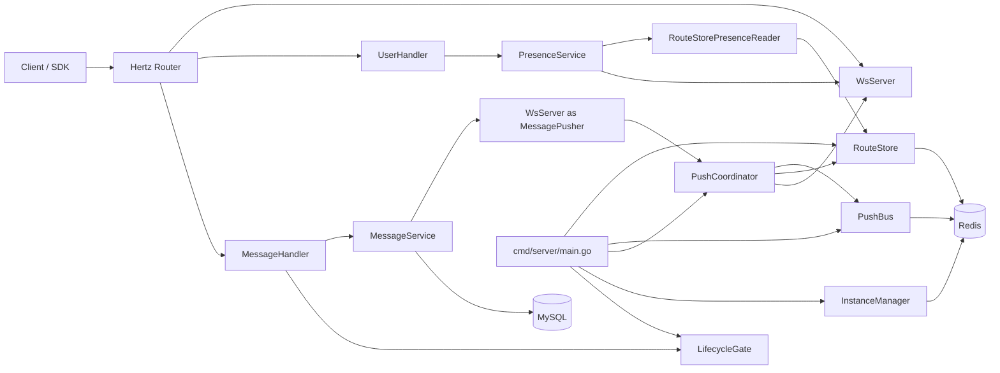

# Route-Only Multi-Instance Push Phase 1 Implementation Plan

> **For Claude:** REQUIRED SUB-SKILL: Use superpowers:executing-plans to implement this plan task-by-task.

**Goal:** Build a phase-1 route-only multi-instance push foundation that preserves current single-instance behavior while adding explicit lifecycle control, cross-instance route delivery, and aggregated presence.

**Architecture:** Keep `MessageService` as the write-path entry. Keep `WsServer` as a local websocket runtime only: connection ingress, client loops, local delivery, and local connection snapshotting. Introduce explicit cluster-facing primitives for lifecycle, route storage, instance state, push bus, and presence aggregation, with route lookup as the only remote delivery mechanism in phase 1. Prefer correctness over optimization: no broadcast fallback, no hidden auto-downgrade in multi-instance mode, and no leaking HTTP response concerns into service or cluster code.

**Tech Stack:** Go, Hertz, gorilla/websocket, Redis, MySQL, existing `internal/service`, `internal/gateway`, `pkg/response`, `pkg/errcode`

---

## Formal Architecture Description

### System Intent

Phase 1 changes the system from a single-instance, local-only realtime push runtime into a route-only multi-instance architecture without changing the durable message write path.

The adjusted architecture keeps these hard boundaries:

- `MessageService` remains the only persisted-message write entry for both HTTP `/msg/send` and websocket `WSSendMsg`
- `WsServer` remains the local websocket runtime shell for connection ingress, local client lifecycle, local delivery, and local route snapshots
- `internal/cluster` owns distributed coordination concerns: lifecycle, route storage, instance liveness, cross-instance publish/subscribe, and accepted dispatch backlog drain semantics
- MySQL remains the source of truth for messages and conversation state
- Redis stores only cluster coordination state: route keys, instance liveness, and per-instance push channels

### Deployment Modes

| Mode | `cross_instance.enabled` | Realtime delivery model | Cluster dependency policy |
| --- | --- | --- | --- |
| Single instance | `false` | local-only dispatch through `PushCoordinator` into `WsServer` | cluster dependencies may be nil or no-op |
| Multi instance | `true` | local delivery plus route lookup plus one envelope per remote target instance | route store, push bus, and instance manager are required; startup fails fast if they cannot initialize or verify |

### Layered Architecture

| Layer | Primary components | Responsibilities | Explicit non-responsibilities |
| --- | --- | --- | --- |
| Ingress and API | `internal/router`, `internal/handler`, `/ws`, `/ready` | request admission, auth boundary integration, response rendering, readiness exposure | business persistence logic, cluster coordination |
| Application services | `MessageService`, `PresenceService` | message validation/persistence, sequence allocation, presence aggregation | websocket runtime ownership, Redis pub/sub orchestration, HTTP response transport details inside service code |
| Local realtime runtime | `WsServer`, `UserMap`, `Client`, `ClientConn` | local connection lifecycle, local connection lookup, local push, local presence snapshot, immediate route mirroring hooks | remote route lookup, instance liveness, remote publish/subscribe |
| Cluster coordination | `LifecycleGate`, `RouteStore`, `InstanceManager`, `PushBus`, `PushCoordinator`, reconcile loop | lifecycle state machine, route storage and repair, instance alive/routeable state, per-instance envelope transport, accepted dispatch drain accounting | message persistence, websocket handshake, handler response formatting |
| Infrastructure | MySQL, Redis | durable storage and coordination backend | application-layer policy |

### Runtime Topology



### Component Responsibilities

`cmd/server/main.go` is the composition root. It creates the lifecycle gate, websocket runtime, optional cluster dependencies, readiness wiring, and shutdown sequencing.

`MessageService` owns the durable send path:
- validate request semantics
- allocate sequence numbers
- persist messages and conversation side effects
- trigger asynchronous realtime dispatch after persistence succeeds

`WsServer` owns local runtime behavior:
- websocket upgrade and client construction
- local register/unregister event loop
- exact local `conn_id -> client` lookup
- local delivery to current-instance connections
- local route snapshots for reconcile and presence
- immediate route mirror writes on register/unregister when route storage is enabled

`PushCoordinator` owns route-only realtime dispatch:
- accept asynchronous dispatch work from `MessageService`
- deliver current-instance refs locally first
- read route refs once for the target users
- group remote refs by target instance
- publish at most one `PushEnvelope` per remote instance
- track accepted dispatch until local delivery and remote publish attempts finish

`RouteStore` owns Redis-backed route visibility:
- one route key per connection
- per-user and per-instance secondary indexes
- lookup for routeable delivery
- lookup for alive-only presence
- reconcile-based repair of missing or stale instance-owned routes

`InstanceManager` owns Redis-backed instance state publication:
- publish `ready`, `routeable`, `draining`, and `updated_at`
- refresh alive TTL on heartbeat
- support immediate `SyncNow(ctx)` writes after lifecycle transitions that change routing eligibility

`PresenceService` owns handler-facing presence aggregation:
- read local presence through a narrow service-facing interface
- read remote alive presence through a narrow remote reader interface
- merge local and remote refs while excluding duplicate local refs
- return partial local-only results when remote presence cannot be read

### Core Runtime Flows

#### 1. Persisted Message Send

1. HTTP or websocket send enters the ingress layer and acquires a send lease from `LifecycleGate`.
2. `MessageService` validates, persists, allocates sequence state, and completes durable side effects.
3. After persistence succeeds, `MessageService` calls `AsyncPushToUsers(...)`.
4. `PushCoordinator` marks the dispatch as accepted, performs local delivery, reads remote routes, and publishes one route-only envelope per target instance.
5. The remote instance receives the envelope from `PushBus` and delivers directly to the listed local connection refs without a second route lookup.

#### 2. Route Registration And Presence

1. Successful local websocket register/unregister events mirror route changes into `RouteStore` immediately.
2. The reconcile loop periodically repairs Redis route state from the authoritative current-instance local snapshot.
3. `InstanceManager` publishes whether the instance is alive, ready, routeable, and draining.
4. `PresenceService` merges local presence with remote alive refs; if remote presence fails, it returns local-only data plus partial metadata.

#### 3. Startup

For multi-instance mode, startup order is strict:

1. construct `LifecycleGate`, `WsServer`, and cluster dependencies
2. start the per-instance subscription and wait until it is confirmed ready
3. reconcile the current-instance route snapshot into Redis
4. publish initial `alive/routeable` instance state
5. start heartbeat and periodic reconcile loops
6. expose HTTP readiness and websocket ingress

This order prevents advertising an instance as routeable before it can receive remote envelopes or before stale routes are repaired.

#### 4. Shutdown

Shutdown is owned by `cmd/server/main.go` and uses one shared deadline derived from `DrainTimeoutSeconds`.

1. `BeginDrain(DrainReasonPlanned)` marks the instance not ready, closes ingress, and rejects new send leases
2. planned drain keeps `routeable=true` while local connections naturally drain, up to `DrainRouteableGraceSeconds`
3. after local drain or grace timeout, `MarkRouteableOff()` removes the instance from remote route selection
4. wait for inflight send leases to reach zero
5. wait for accepted dispatch backlog to reach zero
6. close the send path, then cancel subscription, websocket runtime, reconcile, and heartbeat workers
7. mark the instance stopped

If the shared drain deadline expires first, the send path is force-closed and teardown continues in degraded mode rather than hanging the process.

### Architectural Invariants

- `MessageService` remains the only durable write path.
- `WsServer` is a local runtime, not a distributed coordinator.
- `online`, `routeable`, and `ready` are separate concepts and must not be collapsed.
- Route mirroring on register/unregister is the primary fast path; reconcile is repair-only.
- Phase 1 uses route-only delivery. There is no broadcast fallback and no hidden downgrade to partial cluster mode at startup.
- `entity.Message` must not be published directly across instances; remote delivery uses `PushMessage` inside `PushEnvelope`.
- Accepted asynchronous dispatch participates in shutdown correctness and must be visible to `WaitDispatchDrained(ctx)`.
- `internal/service` and `internal/cluster` must not depend on `pkg/response`.

---

## Scope And Non-Goals

**In scope**
- Route-only cross-instance push for existing message send flows.
- Explicit lifecycle gating for ingress, send, readiness, and shutdown.
- Redis-backed route storage with reconcile and repair.
- Presence aggregation that merges local and remote alive connections.
- Startup and shutdown wiring that keeps single-instance mode working unchanged.

**Out of scope**
- Broadcast fallback or hybrid route-plus-broadcast behavior.
- A generic cluster capability control plane.
- Large-scale rewrite of `WsServer`, `Client`, or message protocol.
- New public API fields beyond optional response `meta`.
- Active drain kick loops or recovery-probe state machines. Phase 1 drain relies on ingress close, routeability transition, natural disconnect, and grace timeout.

---

## Architecture Decisions

### 1. Write Path Ownership

`MessageService` remains the only write-path entry for persisted messages. HTTP `/msg/send` and websocket `WSSendMsg` both continue to call `MessageService.SendMessage(...)`.

**Decision:** Keep write logic centralized and make lifecycle gating an edge concern around the handler and gateway.

**Why**
- Preserves current transactional behavior in [internal/service/message_service.go](/Users/bytedance/projects/nexo_v2/internal/service/message_service.go).
- Avoids duplicating message validation and persistence logic in cluster code.
- Keeps phase 1 incremental.

Additional boundary:
- request admission and persistence are controlled by `LifecycleGate` send leases
- accepted async realtime dispatch is controlled separately by the push coordinator backlog
- shutdown must wait for both, because `MessageService.SendMessage(...)` persists first and only then enqueues async push work

### 2. Runtime Boundary

`WsServer` remains a local runtime shell only.

`WsServer` owns:
- websocket handshake
- local register/unregister event loop
- local push to connected clients
- local connection snapshots for route registration and presence
- local `conn_id -> client` lookup for exact local delivery

`WsServer` does not own:
- remote route lookup
- Redis-backed route storage
- instance liveness records
- cross-instance publish / subscribe orchestration
- accepted dispatch backlog drain accounting
- handler-facing presence aggregation

**Decision:** Put cross-instance behavior in a dedicated `internal/cluster` package and let `WsServer` delegate to it through narrow interfaces. `WsServer` itself must still run under an explicit runtime context so shutdown can keep it alive during drain and stop it only after send-path closure.

### 3. Presence Query Boundary

Presence aggregation remains a handler-facing use case, but it must not import `pkg/response` and must not depend on DTOs defined in `internal/gateway/ws_server.go`.

**Decision:** Keep the query service in `internal/service/presence_service.go`, but make it depend only on narrow interfaces defined in `service` itself. `internal/cluster` may provide implementations of those interfaces at wiring time. Define presence DTOs in `service` and return a domain result like:

```go
type PresenceQueryResult struct {
    Users      []*OnlineStatusResult
    Partial    bool
    DataSource string
}
```

The handler converts `Partial` and `DataSource` into `response.Meta`.

### 4. Lifecycle Model

Lifecycle is an explicit state machine, not a bag of booleans.

**Decision:** Model a small state machine with a derived snapshot:

```go
type LifecyclePhase string

const (
    LifecyclePhaseServing    LifecyclePhase = "serving"
    LifecyclePhaseDraining   LifecyclePhase = "draining"
    LifecyclePhaseSendClosed LifecyclePhase = "send_closed"
    LifecyclePhaseStopped    LifecyclePhase = "stopped"
)
```

Allowed behavior by phase:

| Phase | Ready | Routeable | Accept `/ws` | New send lease | Existing inflight sends |
| --- | --- | --- | --- | --- | --- |
| `serving` | true | true | yes | yes | yes |
| `draining` planned/manual | false | true until conn drain or grace timeout | no | no | yes |
| `draining` subscribe fault | false | false immediately | no | no | yes |
| `send_closed` | false | false | no | no | no |
| `stopped` | false | false | no | no | no |

### 5. Failure Policy

If `cross_instance.enabled=false`, cluster components may be nil or no-op.

If `cross_instance.enabled=true`, failure to initialize `RouteStore`, `InstanceManager`, or `PushBus` is a startup error. Do not silently start in partial single-instance mode, because that would create split-brain routing semantics.

At runtime:
- remote route read failure may degrade a push attempt to `local-only`
- remote presence read failure may degrade a query to `local-only` plus `meta.partial=true`
- instance subscription failure is fatal for routeability and must trigger drain
- single envelope decode errors and single publish errors are non-fatal
- when `cross_instance.enabled=false`, realtime local push must still work through a local-only dispatch path

Delivery semantics for phase 1:
- persisted message storage is the source of truth
- realtime push is best-effort acceleration, not the durability boundary
- when remote route read or publish fails, the message may miss realtime delivery but must remain recoverable by pull
- if `AsyncPushToUsers(...)` accepts a task before returning, shutdown must treat that accepted dispatch as pending work and wait for its dispatch attempt or timeout
- emit counters or logs for `route_read_degraded`, `publish_failed`, `presence_local_only`, and `subscription_drain`
- planned drain does not proactively kick existing websocket connections in phase 1
- `DrainTimeoutSeconds` is the hard deadline for the whole drain sequence and bounds how long shutdown may wait for inflight sends plus accepted dispatch backlog before forcing send-path closure

---

## Contracts

### Redis Key Schema

Use the configured prefix from `pkg/constant`.

- `cluster:instance:alive:{instance_id}`
  - JSON `InstanceState`
  - TTL: `instance_alive_ttl`
- `cluster:route:conn:{instance_id}:{conn_id}`
  - JSON `RouteConn`
  - TTL: `route_ttl`
- `cluster:route:user:{user_id}`
  - Redis set of route-conn keys owned by that user
  - TTL refreshed on register/unregister and reconcile
- `cluster:route:instance:{instance_id}`
  - Redis set of route-conn keys owned by that instance
  - TTL refreshed on register/unregister and reconcile
- `cluster:push:{instance_id}`
  - pub/sub channel for route-only envelopes

This schema intentionally avoids per-user hash field TTL problems. A stale route key can expire independently from other routes for the same user.

### Instance State

```go
type InstanceState struct {
    InstanceID string `json:"instance_id"`
    Ready      bool   `json:"ready"`
    Routeable  bool   `json:"routeable"`
    Draining   bool   `json:"draining"`
    UpdatedAt  int64  `json:"updated_at"`
}
```

Filtering rules:
- Push route lookup uses `alive && routeable`
- Presence lookup uses `alive` only

### Route Contract

```go
type RouteConn struct {
    UserID     string `json:"user_id"`
    ConnID     string `json:"conn_id"`
    InstanceID string `json:"instance_id"`
    PlatformID int    `json:"platform_id"`
}
```

Route registration is high-reliability plus eventual repair. It is not a synchronous hard guarantee. The authoritative repair mechanism is reconcile over instance-owned local snapshots.

When `cross_instance.enabled=true`:
- successful local register events must call `RouteStore.RegisterConn(...)` immediately
- successful local unregister events must call `RouteStore.UnregisterConn(...)` immediately
- reconcile exists to repair missed writes or stale leftovers, not to serve as the primary registration path

### Push Envelope

Do not publish raw `entity.Message` across instances. Publish a stable delivery DTO.

```go
type PushMessage struct {
    ServerMsgID    int64  `json:"server_msg_id"`
    ConversationID string `json:"conversation_id"`
    Seq            int64  `json:"seq"`
    ClientMsgID    string `json:"client_msg_id"`
    SenderID       string `json:"sender_id"`
    RecvID         string `json:"recv_id,omitempty"`
    GroupID        string `json:"group_id,omitempty"`
    SessionType    int32  `json:"session_type"`
    MsgType        int32  `json:"msg_type"`
    Content        struct {
        Text   string `json:"text,omitempty"`
        Image  string `json:"image,omitempty"`
        Video  string `json:"video,omitempty"`
        Audio  string `json:"audio,omitempty"`
        File   string `json:"file,omitempty"`
        Custom string `json:"custom,omitempty"`
    } `json:"content"`
    SendAt int64 `json:"send_at"`
}

type ConnRef struct {
    UserID     string `json:"user_id"`
    ConnID     string `json:"conn_id"`
    PlatformID int    `json:"platform_id"`
}

type PushPayload struct {
    Message *PushMessage `json:"message"`
}

type PushEnvelope struct {
    Version        int                   `json:"version"`
    PushID         string                `json:"push_id"`
    SourceInstance string                `json:"source_instance"`
    SentAt         int64                 `json:"sent_at"`
    TargetConnMap  map[string][]ConnRef  `json:"target_conn_map"`
    Payload        *PushPayload          `json:"payload"`
}
```

Remote delivery rules:
- `PushCoordinator` must know `currentInstanceID`
- route lookup may return both local and remote refs
- local refs are delivered through `WsServer`
- refs whose target instance is `currentInstanceID` must never be re-published through `PushBus`
- publish at most one envelope per remote target instance

### Dispatch Completion Semantics

`AsyncPushToUsers(...)` stays asynchronous to the caller, but it is not allowed to become invisible to shutdown correctness.

- a push implementation must either reject a task immediately or mark it as accepted before `AsyncPushToUsers(...)` returns
- an accepted task remains pending until local delivery plus remote publish attempts finish
- `WaitDispatchDrained(ctx)` must wait for accepted pending dispatch to reach zero
- planned shutdown uses one shared deadline derived from `DrainTimeoutSeconds` to wait for both inflight send leases and accepted dispatch backlog

This keeps the current service contract while making drain behavior verifiable.

### Presence Semantics

Presence keeps the current response shape, but the semantics must be explicit:

- `status=online` means the user has at least one connection on an alive instance
- `status=offline` means no alive connection is known
- `routeable=false` does not mean offline

When remote presence read fails:
- return local results only
- do not fail the request
- include `meta.partial=true`
- include `meta.data_source="local_only"`

---

## Implementation Plan

### Task 1: Add cluster contract types and lifecycle state machine

**Files:**
- Create: `internal/cluster/contracts.go`
- Create: `internal/cluster/push_protocol.go`
- Create: `internal/cluster/lifecycle_gate.go`
- Test: `internal/cluster/contracts_test.go`
- Test: `internal/cluster/push_protocol_test.go`
- Test: `internal/cluster/lifecycle_gate_test.go`
- Modify: `pkg/errcode/errcode.go`
- Modify: `pkg/response/response.go`
- Test: `pkg/response/response_test.go`

**Step 1: Write the failing tests**

Create `internal/cluster/contracts_test.go` with round-trip encode/decode tests for:

```go
func TestRouteConnJSONRoundTrip(t *testing.T) {}
func TestInstanceStateJSONRoundTrip(t *testing.T) {}
```

Create `internal/cluster/push_protocol_test.go` with round-trip encode/decode tests for:

```go
func TestPushMessageJSONRoundTrip(t *testing.T) {}
func TestPushEnvelopeJSONRoundTrip(t *testing.T) {}
```

Create `internal/cluster/lifecycle_gate_test.go` for the state machine:

```go
func TestAcquireSendLeaseAllowedOnlyInServing(t *testing.T) {}
func TestBeginPlannedDrainRejectsNewLeaseButKeepsRouteable(t *testing.T) {}
func TestBeginSubscribeFaultDrainMarksUnrouteableImmediately(t *testing.T) {}
func TestCloseSendPathWaitsForInflightToDrain(t *testing.T) {}
```

Create `pkg/response/response_test.go`:

```go
func TestErrorUses503ForServerShuttingDown(t *testing.T) {}
func TestSuccessWithMetaIncludesMeta(t *testing.T) {}
```

**Step 2: Run tests to verify they fail**

Run:

```bash
go test ./internal/cluster ./pkg/response
```

Expected:
- FAIL because the cluster contracts, push protocol types, lifecycle gate, `SuccessWithMeta`, and `ErrServerShuttingDown` do not exist yet.

**Step 3: Write minimal implementation**

Create `internal/cluster/contracts.go` with:

```go
type InstanceState struct {
    InstanceID string `json:"instance_id"`
    Ready      bool   `json:"ready"`
    Routeable  bool   `json:"routeable"`
    Draining   bool   `json:"draining"`
    UpdatedAt  int64  `json:"updated_at"`
}

type RouteConn struct {
    UserID     string `json:"user_id"`
    ConnID     string `json:"conn_id"`
    InstanceID string `json:"instance_id"`
    PlatformID int    `json:"platform_id"`
}

type ConnRef struct {
    UserID     string `json:"user_id"`
    ConnID     string `json:"conn_id"`
    PlatformID int    `json:"platform_id"`
}
```

Create `internal/cluster/push_protocol.go` with:

```go
type PushMessage struct {
    ServerMsgID    int64  `json:"server_msg_id"`
    ConversationID string `json:"conversation_id"`
    Seq            int64  `json:"seq"`
    ClientMsgID    string `json:"client_msg_id"`
    SenderID       string `json:"sender_id"`
    RecvID         string `json:"recv_id,omitempty"`
    GroupID        string `json:"group_id,omitempty"`
    SessionType    int32  `json:"session_type"`
    MsgType        int32  `json:"msg_type"`
    Content        struct {
        Text   string `json:"text,omitempty"`
        Image  string `json:"image,omitempty"`
        Video  string `json:"video,omitempty"`
        Audio  string `json:"audio,omitempty"`
        File   string `json:"file,omitempty"`
        Custom string `json:"custom,omitempty"`
    } `json:"content"`
    SendAt int64 `json:"send_at"`
}

type PushPayload struct {
    Message *PushMessage `json:"message"`
}

type PushEnvelope struct {
    Version        int                  `json:"version"`
    PushID         string               `json:"push_id"`
    SourceInstance string               `json:"source_instance"`
    SentAt         int64                `json:"sent_at"`
    TargetConnMap  map[string][]ConnRef `json:"target_conn_map"`
    Payload        *PushPayload         `json:"payload"`
}
```

Create `internal/cluster/lifecycle_gate.go` with an explicit gate:

```go
type LifecyclePhase string
type DrainReason string

type LifecycleSnapshot struct {
    Phase         LifecyclePhase
    Ready         bool
    Routeable     bool
    IngressClosed bool
    InflightSend  int64
    DrainReason   DrainReason
}

type LifecycleGate interface {
    Snapshot() LifecycleSnapshot
    CanAcceptIngress() bool
    AcquireSendLease() (release func(), err error)
    BeginDrain(reason DrainReason) error
    MarkRouteableOff() error
    WaitInflightZero(ctx context.Context) error
    CloseSendPath() error
    MarkStopped() error
}
```

Behavior:
- `AcquireSendLease()` succeeds only in `serving`
- `BeginDrain(DrainReasonPlanned)` sets `ready=false`, `ingressClosed=true`, `phase=draining`, `routeable=true`
- `BeginDrain(DrainReasonSubscribeFault)` additionally sets `routeable=false`
- `MarkRouteableOff()` is idempotent and is used after local conn drain or grace timeout
- `CloseSendPath()` transitions to `send_closed` only after inflight sends reach zero

In `pkg/errcode/errcode.go`, add:

```go
ErrServerShuttingDown = New(1008, "server shutting down")
```

In `pkg/response/response.go`, add:

```go
type Meta map[string]any

type Response struct {
    Code    int    `json:"code"`
    Message string `json:"message"`
    Data    any    `json:"data,omitempty"`
    Meta    Meta   `json:"meta,omitempty"`
}

func SuccessWithMeta(ctx context.Context, c *app.RequestContext, data any, meta Meta) {
    c.JSON(http.StatusOK, Response{
        Code:    0,
        Message: "success",
        Data:    data,
        Meta:    meta,
    })
}
```

Update `Error` and `ErrorWithCode` so `ErrServerShuttingDown` uses `http.StatusServiceUnavailable`.

**Step 4: Run tests to verify they pass**

Run:

```bash
go test ./internal/cluster ./pkg/response
```

Expected:
- PASS

**Step 5: Commit**

```bash
git add internal/cluster/contracts.go internal/cluster/contracts_test.go internal/cluster/push_protocol.go internal/cluster/push_protocol_test.go internal/cluster/lifecycle_gate.go internal/cluster/lifecycle_gate_test.go pkg/errcode/errcode.go pkg/response/response.go pkg/response/response_test.go
git commit -m "feat: add cluster contracts and lifecycle state machine"
```

---

### Task 2: Harden local websocket runtime before remote correctness depends on it

**Files:**
- Modify: `internal/gateway/user_map.go`
- Modify: `internal/gateway/ws_server.go`
- Modify: `internal/gateway/client_conn.go`
- Modify: `internal/gateway/client.go`
- Test: `internal/gateway/user_map_test.go`
- Test: `internal/gateway/ws_server_runtime_test.go`
- Test: `internal/gateway/client_conn_test.go`
- Test: `internal/gateway/client_test.go`

**Step 1: Write the failing tests**

Create `internal/gateway/user_map_test.go`:

```go
func TestRegisterAndUnregisterAreLocalOnly(t *testing.T) {}
func TestSnapshotRouteConnsReturnsAllLocalConnections(t *testing.T) {}
func TestGetByConnIDReturnsExactClient(t *testing.T) {}
```

Create `internal/gateway/ws_server_runtime_test.go`:

```go
func TestUnregisterClientDoesNotDropCleanupWhenQueueIsFullDuringDrain(t *testing.T) {}
func TestLocalConnSnapshotMatchesRegisteredClients(t *testing.T) {}
```

Create `internal/gateway/client_conn_test.go`:

```go
func TestNewWebSocketClientConnUsesConfiguredWriteChannelSize(t *testing.T) {}
func TestWriteMessageReturnsErrWriteChannelFullWhenBufferIsFull(t *testing.T) {}
```

Create `internal/gateway/client_test.go`:

```go
func TestKickOnlinePrefersControlWriteBeforeClose(t *testing.T) {}
```

**Step 2: Run tests to verify they fail**

Run:

```bash
go test ./internal/gateway
```

Expected:
- FAIL because route snapshots, reliable unregister fallback, configured write buffer sizing, and kick ordering are not implemented yet.

**Step 3: Write minimal implementation**

In `internal/gateway/user_map.go`:
- remove Redis online side effects from `Register` and `Unregister`
- keep the local map behavior unchanged
- add a local `conn_id -> client` index kept in sync on register/unregister
- add:

```go
func (m *UserMap) SnapshotRouteConns(instanceID string) []cluster.RouteConn
func (m *UserMap) GetByConnID(connID string) (*Client, bool)
```

If compatibility helpers like `IsOnline(...)` remain temporarily, they must not be used for phase-1 correctness.

In `internal/gateway/ws_server.go`:
- keep `registerChan` and `unregisterChan`
- add a non-lossy cleanup path for shutdown and queue saturation, for example:

```go
func (s *WsServer) unregisterClientNow(ctx context.Context, client *Client)
```

`UnregisterClient(...)` must not silently drop cleanup events during drain. If the queue is full while draining or stopping, use a bounded direct fallback instead of `default: drop`.

In `internal/gateway/client_conn.go`:
- expand constructor signature to:

```go
func NewWebSocketClientConn(
    conn *websocket.Conn,
    maxMsgSize int64,
    writeWait time.Duration,
    pongWait time.Duration,
    pingPeriod time.Duration,
    writeChannelSize int,
) *WebsocketClientConn
```

In `internal/gateway/client.go`:
- keep `KickOnline()` synchronous
- attempt the control response write before `Close()`
- preserve current close behavior if write fails

**Step 4: Run tests to verify they pass**

Run:

```bash
go test ./internal/gateway
```

Expected:
- PASS, including the Redis-backed route store integration tests

**Step 5: Commit**

```bash
git add internal/gateway/user_map.go internal/gateway/user_map_test.go internal/gateway/ws_server.go internal/gateway/ws_server_runtime_test.go internal/gateway/client_conn.go internal/gateway/client_conn_test.go internal/gateway/client.go internal/gateway/client_test.go
git commit -m "refactor: harden local websocket runtime for cluster correctness"
```

---

### Task 3: Add route store and instance manager with explicit Redis semantics

**Files:**
- Create: `internal/cluster/route_store.go`
- Create: `internal/cluster/instance_manager.go`
- Test: `internal/cluster/route_store_test.go`
- Test: `internal/cluster/route_store_integration_test.go`
- Test: `internal/cluster/instance_manager_test.go`

**Step 1: Write the failing tests**

Create `internal/cluster/route_store_test.go`:

```go
func TestRegisterConnWritesConnKeyUserIndexAndInstanceIndex(t *testing.T) {}
func TestGetUsersConnRefsFiltersByAliveAndRouteable(t *testing.T) {}
func TestGetUsersPresenceConnRefsFiltersOnlyByAlive(t *testing.T) {}
func TestUnregisterConnRemovesConnKeyAndIndexes(t *testing.T) {}
func TestReconcileInstanceRoutesRepairsMissingAndRemovesStale(t *testing.T) {}
```

Create `internal/cluster/route_store_integration_test.go` with Redis-backed tests:

```go
func TestRouteStoreRegisterUnregisterRoundTripWithRedis(t *testing.T) {}
func TestRouteStoreReadPathCleansDanglingIndexEntriesWithRedis(t *testing.T) {}
```

Create `internal/cluster/instance_manager_test.go`:

```go
func TestWriteStatePublishesReadyRouteableAndDraining(t *testing.T) {}
func TestReadyAndRouteableCanDiverge(t *testing.T) {}
func TestHeartbeatRefreshesAliveTTL(t *testing.T) {}
```

Redis-backed integration coverage is required in phase 1. If the repo does not already have a test helper, add a focused helper in this task instead of deferring integration verification. These tests must run under the default `go test ./internal/cluster` command used later in Task 8.

**Step 2: Run tests to verify they fail**

Run:

```bash
go test ./internal/cluster
```

Expected:
- FAIL because `RouteStore` and `InstanceManager` do not exist yet.

**Step 3: Write minimal implementation**

Create `internal/cluster/route_store.go` with:

```go
type RouteStore struct {
    rdb      *redis.Client
    routeTTL time.Duration
}

func (s *RouteStore) RegisterConn(ctx context.Context, conn RouteConn) error
func (s *RouteStore) UnregisterConn(ctx context.Context, conn RouteConn) error
func (s *RouteStore) GetUsersConnRefs(ctx context.Context, userIDs []string) (map[string][]RouteConn, error)
func (s *RouteStore) GetUsersPresenceConnRefs(ctx context.Context, userIDs []string) (map[string][]RouteConn, error)
func (s *RouteStore) ReconcileInstanceRoutes(ctx context.Context, instanceID string, want []RouteConn) error
```

Implementation rules:
- one route key per connection
- user index and instance index contain route-key references
- push lookup filters by instance `alive && routeable`
- presence lookup filters by instance `alive`
- read paths should opportunistically clean dangling index entries
- do not rely on reconcile as the first registration path; runtime register/unregister events must mirror route changes immediately once `WsServer` wiring is added

Create `internal/cluster/instance_manager.go` with:

```go
type InstanceManager struct {
    rdb      *redis.Client
    stateTTL time.Duration
    now      func() time.Time
}

func (m *InstanceManager) WriteState(ctx context.Context, state InstanceState) error
func (m *InstanceManager) ReadState(ctx context.Context, instanceID string) (*InstanceState, error)
func (m *InstanceManager) Run(ctx context.Context, instanceID string, snapshot func() InstanceState) error
```

Do not add broadcast fields or broad capability flags.
All long-lived components in phase 1 must use a `Run(ctx)`-style lifecycle or otherwise terminate solely from context cancellation so shutdown ordering can be tested deterministically.

**Step 4: Run tests to verify they pass**

Run:

```bash
go test ./internal/cluster
```

Expected:
- PASS

**Step 5: Commit**

```bash
git add internal/cluster/route_store.go internal/cluster/route_store_test.go internal/cluster/route_store_integration_test.go internal/cluster/instance_manager.go internal/cluster/instance_manager_test.go
git commit -m "feat: add route store and instance manager"
```

---

### Task 4: Add route-only push protocol, bus, and coordinator

**Files:**
- Create: `internal/cluster/push_bus.go`
- Create: `internal/cluster/push_coordinator.go`
- Modify: `internal/gateway/ws_server.go`
- Test: `internal/cluster/push_bus_test.go`
- Test: `internal/cluster/push_coordinator_test.go`

**Step 1: Write the failing tests**

Create `internal/cluster/push_bus_test.go`:

```go
func TestPublishToInstanceUsesInstanceChannel(t *testing.T) {}
func TestSubscribeInstanceInvokesHandler(t *testing.T) {}
func TestClosePreventsFurtherPublish(t *testing.T) {}
```

Create `internal/cluster/push_coordinator_test.go`:

```go
func TestProcessPushTaskPushesLocalBeforePublishingRemote(t *testing.T) {}
func TestDispatchRouteOnlyPublishesPerInstanceEnvelope(t *testing.T) {}
func TestLocalOnlyModeKeepsSingleInstanceRealtimePush(t *testing.T) {}
func TestRouteReadFailureFallsBackToLocalOnly(t *testing.T) {}
func TestRemoteEnvelopeDeliversWithoutRedisLookup(t *testing.T) {}
func TestExcludeConnIDIsAppliedBeforeLocalAndRemoteGrouping(t *testing.T) {}
func TestNeverPublishesToSourceInstanceEvenIfRouteStoreReturnsLocalRefs(t *testing.T) {}
func TestAcceptedDispatchIsTrackedUntilLocalAndRemoteAttemptsFinish(t *testing.T) {}
```

**Step 2: Run tests to verify they fail**

Run:

```bash
go test ./internal/cluster ./internal/gateway
```

Expected:
- FAIL because the route-only bus and coordinator do not exist yet.

**Step 3: Write minimal implementation**

Create `internal/cluster/push_bus.go`:

```go
type PushBus interface {
    PublishToInstance(ctx context.Context, instanceID string, env *PushEnvelope) error
    SubscribeInstance(
        ctx context.Context,
        instanceID string,
        handler func(context.Context, *PushEnvelope),
        onRuntimeError func(error),
    ) error
    Close() error
}
```

Create `internal/cluster/push_coordinator.go`:

```go
type DispatchDrainer interface {
    WaitDispatchDrained(ctx context.Context) error
}

type LocalDispatcher interface {
    DeliverLocal(ctx context.Context, refs []ConnRef, payload *PushPayload) error
    LocalConnRefs(userIDs []string, excludeConnID string) map[string][]ConnRef
}
```

Coordinator behavior:
- accept `currentInstanceID` as a constructor dependency
- satisfy the existing `service.MessagePusher` interface instead of introducing a second pusher contract
- convert `entity.Message` into `PushMessage`
- when `cross_instance.enabled=false` or remote dependencies are intentionally nil, run in local-only mode and preserve current single-instance realtime push behavior
- `AsyncPushToUsers(...)` must either reject immediately or mark the task as accepted before returning
- accepted tasks increment a pending-dispatch counter
- push local refs first
- read remote route refs once from `RouteStore`
- group remote refs by target instance and publish one envelope per instance
- filter out `currentInstanceID` before remote publish so local refs are never published back to self
- if route lookup fails, log and keep local-only behavior
- decrement the pending-dispatch counter only after local delivery and remote publish attempts finish
- expose `WaitDispatchDrained(ctx)` for shutdown coordination
- when receiving a remote envelope, deliver directly to the provided `ConnRef`s without another Redis lookup

Update `internal/gateway/ws_server.go`:
- keep `WsServer` implementing `service.MessagePusher`
- delegate `AsyncPushToUsers(...)` to `PushCoordinator`
- expose narrow local helpers used by the coordinator instead of embedding cluster logic in `WsServer`

**Step 4: Run tests to verify they pass**

Run:

```bash
go test ./internal/cluster ./internal/gateway
```

Expected:
- PASS

**Step 5: Commit**

```bash
git add internal/cluster/push_bus.go internal/cluster/push_bus_test.go internal/cluster/push_coordinator.go internal/cluster/push_coordinator_test.go internal/gateway/ws_server.go
git commit -m "feat: add route-only push bus and coordinator"
```

---

### Task 5: Add presence query service with a clean handler boundary

**Files:**
- Create: `internal/service/presence_service.go`
- Test: `internal/service/presence_service_test.go`
- Modify: `internal/handler/user_handler.go`
- Test: `internal/handler/user_handler_test.go`

**Step 1: Write the failing tests**

Create `internal/service/presence_service_test.go`:

```go
func TestGetUsersOnlineStatusMergesLocalAndRemotePresence(t *testing.T) {}
func TestGetUsersOnlineStatusReturnsPartialLocalOnlyOnRemoteFailure(t *testing.T) {}
func TestGetUsersOnlineStatusDoesNotTreatRouteableFalseAsOffline(t *testing.T) {}
func TestGetUsersOnlineStatusKeepsPlatformDetailShape(t *testing.T) {}
```

Create `internal/handler/user_handler_test.go`:

```go
func TestGetUsersOnlineStatusRejectsMoreThan100UserIDs(t *testing.T) {}
func TestGetUsersOnlineStatusReturnsSuccessWithMetaOnPartial(t *testing.T) {}
```

**Step 2: Run tests to verify they fail**

Run:

```bash
go test ./internal/service ./internal/handler
```

Expected:
- FAIL because `PresenceService` does not exist and the handler still depends directly on `WsServer`.

**Step 3: Write minimal implementation**

Create `internal/service/presence_service.go`:

```go
type OnlineStatusResult struct {
    UserID               string                  `json:"user_id"`
    Status               int                     `json:"status"`
    DetailPlatformStatus []*PlatformStatusDetail `json:"detail_platform_status,omitempty"`
}

type PlatformStatusDetail struct {
    PlatformID   int    `json:"platform_id"`
    PlatformName string `json:"platform_name"`
    ConnID       string `json:"conn_id"`
}

type PresenceQueryResult struct {
    Users      []*OnlineStatusResult
    Partial    bool
    DataSource string
}
```

Service behavior:
- read local connections through a narrow local interface
- read remote presence through a `RemotePresenceReader` interface defined in `internal/service/presence_service.go`
- exclude the current instance from remote merge
- preserve the current HTTP response shape for each user
- do not import `pkg/response`
- on remote read failure, return local results with `Partial=true` and `DataSource="local_only"`

`cluster.RouteStore` may satisfy the remote reader interface, but `service` must not depend on the concrete `cluster.RouteStore` type.

Update `internal/handler/user_handler.go`:
- replace `wsServer *gateway.WsServer` with a presence-query interface
- strengthen request validation to `vd:"len($)>0,len($)<=100"`
- map partial results to `response.SuccessWithMeta(...)`

**Step 4: Run tests to verify they pass**

Run:

```bash
go test ./internal/service ./internal/handler
```

Expected:
- PASS

**Step 5: Commit**

```bash
git add internal/service/presence_service.go internal/service/presence_service_test.go internal/handler/user_handler.go internal/handler/user_handler_test.go
git commit -m "feat: add presence query service and clean handler boundary"
```

---

### Task 6: Wire lifecycle gating into HTTP, websocket, readiness, and startup

**Files:**
- Modify: `internal/handler/message_handler.go`
- Test: `internal/handler/message_handler_test.go`
- Modify: `internal/gateway/ws_server.go`
- Test: `internal/gateway/ws_server_lifecycle_test.go`
- Modify: `internal/router/router.go`
- Test: `internal/router/router_test.go`
- Modify: `internal/config/config.go`
- Test: `internal/config/config_test.go`
- Modify: `cmd/server/main.go`
- Test: `cmd/server/main_test.go`

**Step 1: Write the failing tests**

Create `internal/handler/message_handler_test.go`:

```go
func TestSendMessageRejectsWhenGateClosed(t *testing.T) {}
func TestSendMessageReleasesLeaseAfterServiceCall(t *testing.T) {}
```

Create `internal/gateway/ws_server_lifecycle_test.go`:

```go
func TestHandleConnectionRejectsWhenIngressClosed(t *testing.T) {}
func TestHandleSendMsgRejectsWhenLeaseUnavailable(t *testing.T) {}
func TestAsyncPushToUsersRejectsWhenSendPathClosed(t *testing.T) {}
func TestRegisterClientMirrorsRouteStoreImmediatelyWhenEnabled(t *testing.T) {}
func TestUnregisterClientMirrorsRouteStoreImmediatelyWhenEnabled(t *testing.T) {}
```

Create `internal/router/router_test.go`:

```go
func TestReadyEndpointReturns503WhenNotReady(t *testing.T) {}
```

Create `internal/config/config_test.go`:

```go
func TestLoadSetsCrossInstanceDefaults(t *testing.T) {}
func TestLoadSetsReconcileIntervalDefaultBelowRouteTTL(t *testing.T) {}
```

Create `cmd/server/main_test.go` for extracted wiring helpers:

```go
func TestBuildServerDependenciesGeneratesInstanceIDWhenEmpty(t *testing.T) {}
func TestBuildServerDependenciesFailsFastWhenCrossInstanceEnabledAndClusterInitFails(t *testing.T) {}
func TestBuildServerDependenciesKeepsLocalRealtimePushWhenCrossInstanceDisabled(t *testing.T) {}
func TestBuildServerDependenciesWiresMessageHandlerWithGate(t *testing.T) {}
func TestBuildServerDependenciesWiresUserHandlerWithPresenceService(t *testing.T) {}
```

**Step 2: Run tests to verify they fail**

Run:

```bash
go test ./internal/handler ./internal/gateway ./internal/router ./internal/config ./cmd/server
```

Expected:
- FAIL because lifecycle-aware wiring and cross-instance config do not exist yet.

**Step 3: Write minimal implementation**

In `internal/handler/message_handler.go`:
- inject a small send-gate interface:

```go
type SendGate interface {
    AcquireSendLease() (func(), error)
}
```

Acquire the lease before calling `MessageService.SendMessage(...)`.

In `internal/gateway/ws_server.go`:
- inject `cluster.LifecycleGate`
- reject websocket handshake when ingress is closed
- acquire a send lease before handling `WSSendMsg`
- reject or drop `AsyncPushToUsers(...)` when the send path is closed
- when a `RouteStore` dependency is configured, call `RegisterConn(...)` from successful local register and `UnregisterConn(...)` from successful local unregister
- treat immediate route registration as the primary fast path; reconcile remains repair-only

In `internal/router/router.go`:
- add `/ready`
- use the gate snapshot to return `200` or `503`

In `internal/config/config.go`, add:

```go
type CrossInstanceConfig struct {
    Enabled                     bool   `mapstructure:"enabled"`
    InstanceID                  string `mapstructure:"instance_id"`
    HeartbeatSecond             int    `mapstructure:"heartbeat_second"`
    RouteTTLSeconds             int    `mapstructure:"route_ttl_seconds"`
    InstanceAliveTTLSeconds     int    `mapstructure:"instance_alive_ttl_seconds"`
    ReconcileIntervalSeconds    int    `mapstructure:"reconcile_interval_seconds"`
    DrainTimeoutSeconds         int    `mapstructure:"drain_timeout_seconds"`
    DrainRouteableGraceSeconds  int    `mapstructure:"drain_routeable_grace_seconds"`
}
```

Semantics:
- `ReconcileIntervalSeconds` is the reconcile loop interval; if unset, default it to a value strictly below `RouteTTLSeconds` such as `max(1, RouteTTLSeconds/3)`
- `DrainRouteableGraceSeconds` controls how long the instance may remain routeable during planned drain
- `DrainTimeoutSeconds` is the total shutdown drain deadline; it bounds `WaitInflightZero(...)` and `WaitDispatchDrained(...)`
- if `DrainTimeoutSeconds` expires first, force close the send path, log a degraded shutdown event, and continue process teardown

In `cmd/server/main.go`:
- extract `buildServerDependencies(...)`
- create a root context with cancel instead of `context.TODO()`
- generate `instanceID` if empty
- when `cross_instance.enabled=false`, allow cluster dependencies to stay nil or no-op, but still wire a local-only push path so `WsServer.AsyncPushToUsers(...)` preserves current single-instance realtime delivery
- when `cross_instance.enabled=true`, fail fast on cluster init errors
- start `WsServer.Run(wsRuntimeCtx)` under its own child context
- start long-lived cluster workers under dedicated child contexts so shutdown can cancel them in a controlled order later
- start reconcile with `cross_instance.reconcile_interval_seconds`
- wire:
  - lifecycle gate
  - route store
  - instance manager
  - push bus
  - push coordinator
  - presence service
  - message handler send gate
  - user handler presence service
  - router readiness endpoint

**Step 4: Run tests to verify they pass**

Run:

```bash
go test ./internal/handler ./internal/gateway ./internal/router ./internal/config ./cmd/server
```

Expected:
- PASS

**Step 5: Commit**

```bash
git add internal/handler/message_handler.go internal/handler/message_handler_test.go internal/gateway/ws_server.go internal/gateway/ws_server_lifecycle_test.go internal/router/router.go internal/router/router_test.go internal/config/config.go internal/config/config_test.go cmd/server/main.go cmd/server/main_test.go
git commit -m "feat: wire lifecycle, readiness, and cluster startup"
```

---

### Task 7: Add reconcile worker and shutdown orchestration regression coverage

**Files:**
- Create: `internal/cluster/route_reconcile.go`
- Modify: `internal/cluster/route_store.go`
- Modify: `internal/cluster/instance_manager.go`
- Modify: `internal/cluster/push_coordinator.go`
- Modify: `internal/gateway/ws_server.go`
- Modify: `cmd/server/main.go`
- Test: `internal/cluster/route_reconcile_test.go`
- Test: `internal/cluster/shutdown_test.go`
- Test: `cmd/server/main_test.go`

**Step 1: Write the failing tests**

Create `internal/cluster/route_reconcile_test.go`:

```go
func TestReconcileRepairsMissingRouteEntry(t *testing.T) {}
func TestReconcileRemovesStaleInstanceOwnedConn(t *testing.T) {}
```

Create `internal/cluster/shutdown_test.go`:

```go
func TestShutdownRejectsNewSendsButAllowsInflightLeaseToFinish(t *testing.T) {}
func TestPlannedDrainKeepsRouteableTrueUntilConnectionsDrainOrGraceTimeout(t *testing.T) {}
func TestShutdownWaitsAcceptedDispatchBacklogBeforeSendClose(t *testing.T) {}
func TestDrainTimeoutForcesCloseSendPathAndRecordsDegradedShutdown(t *testing.T) {}
func TestSubscribeFaultMarksInstanceUnrouteableImmediately(t *testing.T) {}
func TestSubscriptionRuntimeFailureTriggersDrainButSingleEnvelopeDecodeErrorDoesNot(t *testing.T) {}
```

**Step 2: Run tests to verify they fail**

Run:

```bash
go test ./internal/cluster ./internal/gateway ./cmd/server
```

Expected:
- FAIL because reconcile repair, shutdown orchestration, and process-level shutdown wiring are not complete.

**Step 3: Write minimal implementation**

Create `internal/cluster/route_reconcile.go`:

```go
type LocalRouteSnapshotter interface {
    SnapshotRouteConns(instanceID string) []RouteConn
}

func RunRouteReconcileLoop(
    ctx context.Context,
    interval time.Duration,
    instanceID string,
    snapshotter LocalRouteSnapshotter,
    routeStore *RouteStore,
) error
```

Implementation rules:
- periodically reconcile the authoritative local snapshot against Redis
- repair missing conn keys and indexes
- remove stale instance-owned routes
- return when `ctx.Done()` so the caller can control stop order through cancellation

Shutdown behavior:
1. `BeginDrain(DrainReasonPlanned)` sets `ready=false`, closes ingress, rejects new send leases
2. keep `routeable=true` while local connections still exist, until either:
   - local connections drain to zero, or
   - `drain_routeable_grace_seconds` expires
3. while `routeable=true`, keep `wsRuntimeCtx` and the route-subscription loop alive so existing local connections can still receive remote route deliveries
4. then call `MarkRouteableOff()`
5. cancel the route subscription / remote envelope receive loop
6. derive one shared drain deadline from `DrainTimeoutSeconds`
7. wait for inflight sends to reach zero using that deadline
8. wait for accepted dispatch backlog to reach zero using the remaining time budget from the same deadline
9. if both waits finish before the deadline, close send path normally
10. if `DrainTimeoutSeconds` expires first, force close send path, emit a degraded shutdown log or metric, and continue teardown
11. cancel `wsRuntimeCtx`, reconcile loop, and instance heartbeat
12. wait for worker exit and mark stopped

For subscribe fault:
- mark `routeable=false` immediately
- then begin drain

Do not make `UnregisterClient(...)` lossy again. Shutdown convergence depends on accurate local connection counts.

Update `cmd/server/main.go`:
- own the process-level shutdown sequence triggered by signals
- stop Hertz ingress first so no new HTTP or websocket upgrades are accepted
- keep `wsRuntimeCtx` and route-subscription context alive during planned drain while `routeable=true`
- use one shutdown deadline derived from `DrainTimeoutSeconds` across both `WaitInflightZero(...)` and `WaitDispatchDrained(...)`
- after `MarkRouteableOff()`, cancel child contexts in this order:
  1. route subscription / remote envelope receive loop
  2. ws runtime loop
  3. reconcile loop
  4. instance heartbeat
- only mark the process stopped after gate transition, send-path closure, and worker cancellation complete

Add `cmd/server/main_test.go` coverage for:

```go
func TestShutdownSequenceBeginsDrainBeforeStoppingWorkers(t *testing.T) {}
func TestShutdownSequenceWaitsInflightBeforeCloseSendPath(t *testing.T) {}
func TestShutdownSequenceWaitsAcceptedDispatchBacklogBeforeClose(t *testing.T) {}
func TestShutdownSequenceHonorsDrainTimeoutBeforeForcingClose(t *testing.T) {}
func TestShutdownSequenceKeepsRouteSubscriptionAliveUntilRouteableOff(t *testing.T) {}
func TestShutdownSequenceCancelsWsRuntimeAfterCloseSendPath(t *testing.T) {}
```

**Step 4: Run tests to verify they pass**

Run:

```bash
go test ./internal/cluster ./internal/gateway ./cmd/server
```

Expected:
- PASS

**Step 5: Commit**

```bash
git add internal/cluster/route_reconcile.go internal/cluster/route_reconcile_test.go internal/cluster/shutdown_test.go internal/cluster/route_store.go internal/cluster/instance_manager.go internal/cluster/push_coordinator.go internal/gateway/ws_server.go cmd/server/main.go cmd/server/main_test.go
git commit -m "feat: add route reconcile loop and shutdown orchestration"
```

---

### Task 8: Run full verification for phase 1

**Files:**
- Modify: none
- Test: existing and newly added tests

**Step 1: Run cluster and gateway tests**

Run:

```bash
go test ./internal/cluster ./internal/gateway -count=1
```

Expected:
- PASS, including the Redis-backed route store integration tests

**Step 2: Run handler, service, config, router, response tests**

Run:

```bash
go test ./internal/handler ./internal/service ./internal/config ./internal/router ./pkg/response -count=1
```

Expected:
- PASS

**Step 3: Run project-wide verification for touched packages**

Run:

```bash
go test ./... -count=1
```

Expected:
- PASS

**Step 4: Review final diff before integration**

Run:

```bash
git diff --stat
git diff -- internal/cluster internal/gateway internal/handler internal/service internal/config internal/router cmd/server pkg/response pkg/errcode
```

Expected:
- Only the intended phase-1 files changed.

**Step 5: Commit final verification checkpoint**

```bash
git add internal/cluster internal/gateway internal/handler internal/service internal/config internal/router cmd/server pkg/response pkg/errcode
git commit -m "test: verify route-only multi-instance push phase 1"
```

---

## Implementation Notes

- Use `@superpowers:test-driven-development` before implementation.
- Use `@superpowers:executing-plans` when executing this file in another session.
- Do not introduce broadcast code paths in phase 1.
- Do not let `UserHandler` or `MessageHandler` depend directly on `WsServer` once the new interfaces exist.
- Keep public behavior unchanged when `cross_instance.enabled=false`.
- Mirror route registration immediately from local register/unregister events when cross-instance mode is enabled; use reconcile only for repair.
- Preserve the current online-status response shape while changing its data source.
- Do not import `pkg/response` from `internal/service` or `internal/cluster`.
- Do not publish raw `entity.Message` across instances.
- Treat remote route registration as eventually repairable, but still perform immediate runtime writes on local register/unregister.
- Treat instance subscription failure as fatal for routeability. Treat single envelope decode failures and single publish failures as non-fatal.
